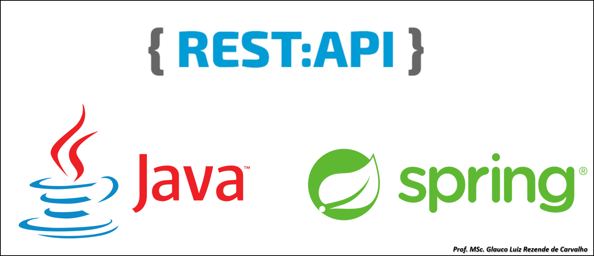
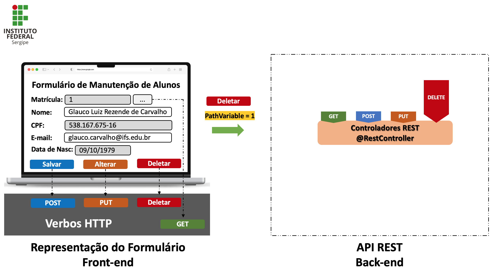

## Oi, eu sou Glauco Luiz! :D

### Sobre
- Mestre em Ciência da Computação pela Universidade Federal de Sergipe [@ufs](https://www.sigaa.ufs.br/sigaa/public/programa/portal.jsf?id=710).
- Administrador de Banco de Dados {SQL Server e Oracle} no Ministério Público de Sergipe [@mpse](https://www.mpse.mp.br/).
- Especialista em Business Intelligence [@powerbi](https://powerbi.microsoft.com/pt-br/).
- Desenvolvedor {backend e frontend}[@spring](https://spring.io/) | [@dotnet](https://dotnet.microsoft.com/pt-br/) | [@react](https://legacy.reactjs.org/) | [@angular](https://angular.io/).
- Professor no Instituto Federal de Sergipe [@ifs](http://www.ifs.edu.br/) | [@curso](http://www.ifs.edu.br/cursos-nova-pagina/259-cursos/superiores/7916-tecnologia-em-analise-e-desenvolvimento-de-sistemas).
- Curriculo Lattes [@lattes](http://lattes.cnpq.br/4026888519877759).

<h1 align="left"> Construindo uma API REST usando Java e Spring Boot </h1>

Este é um exemplo de código-fonte de uma API REST desenvolvida usando a linguagem de programação Java e o framework Spring. Nele, podemos encontrar tópicos essenciais para o sucesso do nosso aprendizado, tais como:
- Implementando e Customizando Repositórios de Dados;
- Usando o Padrão de Projeto DTO <i>(Data Transfer Object)</i>;
- Implementando uma Camada Completa de Segurança;
- Criando e Mapeamento de Entidades;
- Desenvolvendo Controladores REST;
- Utilizando Injeção de Dependência.

>Neste exemplo vamos criar um passo a passo, com alguns detalhes, de como desenvolver uma API REST usando Java e Spring Boot.

>Exemplos de requisições HTTP do Front-end para o Back-end.
- Requisição do tipo <b>POST</b>;

- Requisição do tipo <b>PUT</b>;

- Requisição do tipo <b>DELETE</b>;

- Requisição do tipo <b>GET</b>;

